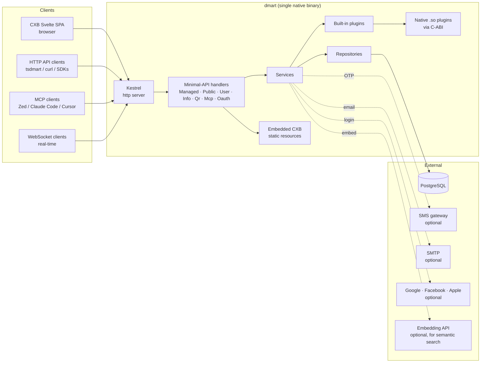
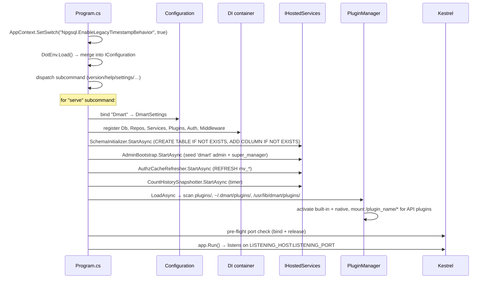

# Architecture

Single-process ASP.NET Core 10 minimal-API app, published as a native AOT
binary (~37 MB), talking to a single PostgreSQL database. No message broker,
no separate worker pool, no reflection-based serialization at runtime.

## System context



## Layered component view

```mermaid
flowchart TD
    subgraph HTTP[HTTP / protocol layer]
        Middleware["Middleware<br/>(CORS, headers, request log, JwtBearer, CXB, rate limiter)"]
        Routing[Routing / endpoint groups]
        Filter[FailedResponseFilter]
    end

    subgraph Api[Api/ — handlers]
        Managed[Managed]
        Public[Public]
        User[User]
        Info[Info]
        Mcp[Mcp]
        Oauth[Oauth]
        Qr[Qr]
    end

    subgraph Domain[Services/ — domain]
        UserSvc[UserService]
        QuerySvc[QueryService]
        PermSvc[PermissionService]
        EntrySvc[EntryService]
        WorkflowSvc[WorkflowService]
        SchemaVal[SchemaValidator]
        Invitation[InvitationService]
        ImportExport[ImportExportService]
        Embedding[EmbeddingService]
    end

    subgraph Data[DataAdapters/Sql — repositories]
        EntryRepo[EntryRepository]
        UserRepo[UserRepository]
        AccessRepo[AccessRepository<br/>roles+permissions]
        AttachRepo[AttachmentRepository]
        SpaceRepo[SpaceRepository]
        HistRepo[HistoryRepository]
        LockRepo[LockRepository]
        OtpRepo[OtpRepository]
        InvRepo[InvitationRepository]
        CntRepo[CountHistoryRepository]
        LinkRepo[LinkRepository]
        Cache[AuthzCacheRefresher<br/>in-memory]
        QHelp[QueryHelper<br/>shared SQL]
    end

    subgraph PG[(PostgreSQL 13+)]
        Tables[entries · users · roles · permissions · spaces · attachments · histories · sessions · invitations · locks · otp · urlshorts · count_history]
    end

    Middleware --> Routing
    Routing --> Filter
    Filter --> Api
    Api --> Domain
    Domain --> Data
    Data --> PG
    Domain --> Cache
    Cache --> Data
```

## Request lifecycle (sequence)

```mermaid
sequenceDiagram
    autonumber
    participant C as Client
    participant K as Kestrel
    participant M as Middleware chain
    participant R as Routing
    participant H as Handler (Api/*)
    participant S as Service
    participant P as PermissionService
    participant DB as Postgres
    participant F as FailedResponseFilter

    C->>K: HTTP POST /managed/query
    K->>M: request
    M->>M: CORS / security headers
    M->>M: JwtBearer: header or auth_token cookie
    M->>M: UseCxb (path-prefix check; passes through)
    M->>M: UseAuthentication / UseAuthorization
    M->>M: UseRequestLogging (start timer)
    M->>R: routed
    R->>H: handler(body, services, HttpContext)
    H->>H: parse body (JsonSerializer + DmartJsonContext)
    H->>S: QueryService.ExecuteAsync(query, actor)
    S->>P: CanQueryAsync(actor, type, space, subpath)
    P->>DB: load user + roles + permissions (on cache miss)
    P-->>S: allow / deny
    alt allowed
        S->>DB: SELECT … FROM entries WHERE … ORDER BY … LIMIT
        S-->>H: Response.Ok(records, attrs)
    else denied
        S-->>H: Response.Ok(empty, total:0)
    end
    H-->>F: Response (object)
    F->>F: Status.Failed → Results.Json with MapErrorToHttpStatus
    F-->>M: HTTP response
    M->>M: trailing: request log (status, duration, user)
    M->>M: INVALID_ROUTE post-pass (only if still 404 and not under /cxb)
    M-->>K: response
    K-->>C: HTTP 200/4xx + JSON body
```

Notable:
- Middleware chain is assembled in `Program.cs` — see the block starting
  around `app.UseDmartResponseHeaders()` (line ~798).
- `FailedResponseFilter` (`Api/FailedResponseFilter.cs`) is an `IEndpointFilter`
  attached to every route group so handlers can return a plain
  `Response.Fail(...)` and have it mapped to HTTP 401/404/409/423/403/400.
- The INVALID_ROUTE middleware is the last-chance transform: any 404 that
  falls through untouched (and isn't under the CXB URL prefix) becomes a 422
  `{error:{type:"request",code:230}}` body. Defined just before `app.UseCxb()`
  in `Program.cs` so its post-next pass runs after CXB's SPA fallback.

## Tech stack

| Piece | Choice | Why |
|---|---|---|
| Runtime | .NET 10 | Native AOT, source-gen JSON, async everywhere |
| Web host | `WebApplication.CreateSlimBuilder` | AOT-compatible, no reflective DI |
| HTTP | Kestrel | Default |
| DB driver | Npgsql (with `EnableLegacyTimestampBehavior`) | Raw SQL against dmart's existing schema |
| JSON | `System.Text.Json` via `DmartJsonContext` source-gen | AOT + snake_case + `[EnumMember]` |
| Auth | `Microsoft.AspNetCore.Authentication.JwtBearer` (lazy configured) | See [auth.md](./auth.md) |
| JWT | hand-rolled HS256 via `Microsoft.IdentityModel.JsonWebTokens` | Avoids reflective `JwtSecurityTokenHandler` |
| Password hashing | `Konscious.Security.Cryptography.Argon2` 1.3.1 | Round-trips with Python's argon2-cffi |
| WebSocket | built-in `WebSocketManager` + custom channel manager | |
| Admin UI | Svelte (`cxb/`) served from embedded resources or filesystem | |
| Plugins | built-in C# + loadable `.so` via C-ABI | See [plugins-and-mcp.md](./plugins-and-mcp.md) |
| Package | RPM (Fedora + el9) + OCI image (podman) + Debian | `dist/` |

## Project layout (annotated)

```
dmart/
├── Program.cs                          CLI dispatcher + web host wiring
├── GlobalUsings.cs                     [InternalsVisibleTo("dmart.Tests")]
├── dmart.csproj                        PublishAot=true; sourcegen JSON
├── build.sh                            ./build.sh → bin/dmart (native)
├── run.sh                              ./run.sh → bin/dmart serve
├── curl.sh                             90 end-to-end HTTP scenarios
├── config.env.sample                   Template for $BACKEND_ENV / ~/.dmart/config.env
│
├── Api/                                ← minimal-API handlers
│   ├── FailedResponseFilter.cs         Response → HTTP status mapper
│   ├── RouteParts.cs                   Splits {**rest} into subpath+shortname
│   ├── Managed/                        /managed/* — authenticated CRUD + query
│   ├── Public/                         /public/* — anonymous-allowed
│   ├── User/                           /user/* — login, profile, OTP, OAuth
│   ├── Info/                           /info/* — manifest, settings, me
│   ├── Mcp/                            /mcp — MCP JSON-RPC transport
│   ├── Oauth/                          /oauth/* — OAuth AS for MCP clients
│   └── Qr/                             /qr/* — QR code generation / validation
│
├── Services/                           ← domain (no HTTP, no SQL)
│   ├── QueryService.cs                 /managed/query + /public/query dispatch
│   ├── PermissionService.cs            the walk; see permissions.md
│   ├── UserService.cs                  login/create/profile/reset
│   ├── EntryService.cs                 Create/Update/Delete entries + plugin hooks
│   ├── WorkflowService.cs              progress-ticket state machine
│   ├── SchemaValidator.cs              JSON Schema on payload.body
│   ├── InvitationService.cs            JWT invitations + delivery
│   ├── WebSocketManager.cs             channel broadcasts
│   ├── ImportExportService.cs          zip ↔ entries
│   ├── EmbeddingService.cs             semantic-indexer companion
│   ├── SmsSender.cs                    HTTP client for SMPP gateway
│   ├── SmtpSender.cs                   System.Net.Mail, AOT-safe
│   ├── CsvService.cs                   CSV import/export per schema
│   └── Result.cs                       small Result<T> for service-level errors
│
├── DataAdapters/Sql/                   ← Npgsql repositories
│   ├── Db.cs                           connection string assembly + open helper
│   ├── SqlSchema.cs                    CREATE TABLE IF NOT EXISTS + ALTER ADD patches
│   ├── SchemaInitializer.cs            IHostedService — runs SqlSchema at boot
│   ├── AdminBootstrap.cs               IHostedService — creates hardcoded 'dmart' + super_admin
│   ├── QueryHelper.cs                  WHERE/ORDER/ACL/aggregation SQL
│   ├── EntryRepository.cs              entries table
│   ├── UserRepository.cs               users + sessions
│   ├── AccessRepository.cs             roles + permissions + mv_* cache
│   ├── AttachmentRepository.cs         attachments (comments, reactions, media, …)
│   ├── SpaceRepository.cs              spaces
│   ├── HistoryRepository.cs            histories (change log)
│   ├── LockRepository.cs               locks
│   ├── OtpRepository.cs                otp
│   ├── InvitationRepository.cs         invitations
│   ├── CountHistoryRepository.cs       count_history (periodic snapshots)
│   ├── LinkRepository.cs               urlshorts (short links)
│   ├── HealthCheckRepository.cs        health-check queries
│   ├── AuthzCacheRefresher.cs          mv_user_roles / mv_role_permissions REFRESH + in-memory user-access cache
│   ├── JsonbHelpers.cs                 C# ↔ JSONB round-trip helpers
│   └── EntryMapper / AttachmentMapper / SpaceMapper  Entry → Record shapers
│
├── Models/
│   ├── Api/                            Query, Request, Record, Response, Error, InternalErrorCode
│   ├── Core/                           User, Role, Permission, Space, Entry, Attachment, Locator, Payload, Translation, AclEntry, Event
│   ├── Enums/                          ResourceType, QueryType, RequestType, ContentType, ActionType, Language, Status, UserType, InvitationChannel, SortType, etc.
│   └── Json/                           DmartJsonContext, EnumMemberConverter
│
├── Auth/
│   ├── JwtBearerSetup.cs               JwtBearer lazy-config + cookie fallback
│   ├── JwtIssuer.cs                    HS256 access/refresh token mint
│   ├── InvitationJwt.cs                {data, expires} payload shape
│   ├── PasswordHasher.cs               Argon2id wrapper
│   ├── PasswordRules.cs                Python-parity PASSWORD regex
│   ├── OtpProvider.cs                  Generate + dispatch (SMS/email/log)
│   └── OAuth/                          GoogleProvider, FacebookProvider, AppleProvider, OAuthUserResolver
│
├── Middleware/
│   ├── CxbMiddleware.cs                /cxb/* static + SPA fallback + config.json rewrite
│   ├── RequestLoggingMiddleware.cs     JSONL access log when LOG_FILE set
│   ├── ResponseHeadersMiddleware.cs    CORS + X-Frame-Options + HSTS + OPTIONS preflight
│   └── WebSocketMiddleware.cs          /ws channel endpoint
│
├── Plugins/
│   ├── IHookPlugin.cs · IApiPlugin.cs  contracts
│   ├── PluginManager.cs                discovery + filter match + dispatch
│   ├── BuiltIn/                        ResourceFoldersCreation, RealtimeUpdatesNotifier, AuditPlugin, McpSseBridgePlugin, SemanticIndexerPlugin, DbSizeInfoPlugin
│   └── Native/                         NativePluginLoader (dlopen + dlsym) + subprocess runner
│
├── Config/
│   ├── DmartSettings.cs                bound from IConfiguration section "Dmart"
│   ├── DotEnvStrictCheck.cs            refuse unknown keys in config.env
│   └── SettingsSerializer.cs           redacted snapshot for GET /info/settings
│
├── Cli/                                dmart cli (REPL + script runner)
├── Utils/                              DotEnv, LogSink, correlation id, etc.
│
├── dmart.Tests/                        xUnit
│   ├── Unit/                           pure logic (no DB)
│   └── Integration/                    DB-backed flows + HTTP end-to-end (via DmartFactory)
│
├── cxb/                                Svelte SPA (admin UI, embedded)
├── plugins/                            built-in plugin configs (+ source for some)
├── custom_plugins_sdk/                 samples (C# api, C# hook, subprocess)
└── dist/                               RPM / Debian / OCI packaging
```

## Startup sequence



## Design principles

1. **Wire parity with Python.** When Python's behavior and ours diverge,
   ours is the bug. See [data-model.md](./data-model.md) for the non-obvious
   rules (subpath slashes, filter_schema_names=["meta"] sentinel,
   enum member strings, hash format).

2. **AOT-first.** No `JwtSecurityTokenHandler`, no reflective serialization,
   no `UseMiddleware<T>` (inline `app.Use`). Source-gen JSON via
   `DmartJsonContext` is the one allowed reflection alternative — and even
   it has quirks (see [debugging.md](./debugging.md)).

3. **Tables, not ORM.** `QueryHelper` emits raw parameterized SQL. We match
   the schema dmart Python's Alembic migrations produced. `SqlSchema.cs`
   has forward-compat `ALTER TABLE … ADD COLUMN IF NOT EXISTS` patches.

4. **One canonical error shape.** `Response.Fail(int code, string message, string type)`.
   `code` is `InternalErrorCode.*` (mirrors Python integers). No string-keyed
   error codes, no multiple overloads.

5. **Process-local caches, MV-backed authz.** `AuthzCacheRefresher` holds the
   in-memory user-access dict AND runs `REFRESH MATERIALIZED VIEW CONCURRENTLY`
   on `mv_user_roles` / `mv_role_permissions` after every user/role/permission
   write. No cross-instance invalidation (yet).

6. **Plugins are async by design.** `AfterActionAsync` is fired with
   `Task.Run(...)` so a slow plugin can't slow a CRUD response.

## Where to go next

- Wire format, enum encodings, storage rules → [data-model.md](./data-model.md)
- Permission walk internals → [permissions.md](./permissions.md)
- Login/session/JWT mechanics → [auth.md](./auth.md)
- Query semantics → [query.md](./query.md)
