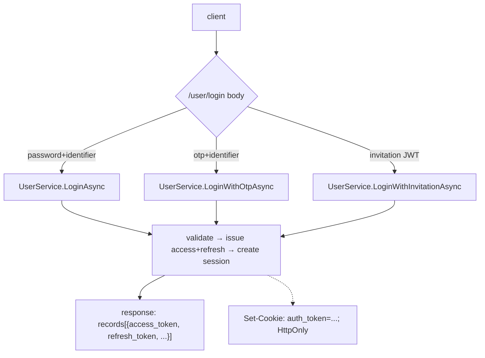
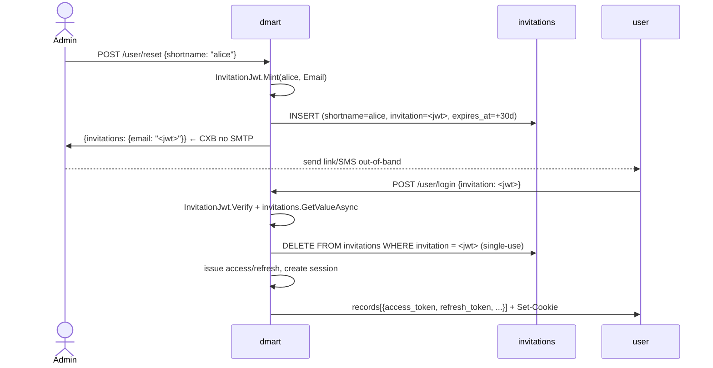

# Authentication

## Overview

Three login paths, all landing on the same `sessions` row + signed JWT:

1. **Password** (`POST /user/login` with shortname/email/msisdn + password).
2. **OTP** (`POST /user/login` with an identifier + `otp`, pre-requested via
   `POST /user/otp-request`).
3. **Invitation JWT** (`POST /user/login` with the single-use token minted
   by `POST /user/reset` or user creation).

Plus three OAuth callbacks (Google / Facebook / Apple) for web + mobile flows.



## The login response shape

Tokens ride in `records[0].attributes`:

```json
{
  "status": "success",
  "records": [
    {
      "resource_type": "user",
      "shortname": "alice",
      "subpath": "users",
      "attributes": {
        "access_token": "eyJ...",
        "refresh_token": "eyJ...",
        "type": "web",
        "email": "...",
        "msisdn": "...",
        "is_email_verified": true,
        "force_password_change": false
      }
    }
  ]
}
```

`Api/User/AuthHandler.cs` also sets `Set-Cookie: auth_token=<access_token>; HttpOnly; SameSite=Lax; Path=/`.
Browser clients (including CXB) rely on the cookie.

## JWT structure

Hand-rolled HS256. Issuer: `Auth/JwtIssuer.cs`. Verified via JwtBearer with
a custom resolver because our tokens have no `kid` header.

Access token payload:

```json
{
  "data": { "shortname": "alice", "type": "web" },
  "expires": 1713500000,
  "iss": "dmart",
  "aud": "dmart",
  "iat": 1713499000,
  "exp": 1713499900
}
```

Refresh token payload: same shape minus `data.type`, longer `exp`.

`data` wraps the identity claims so the envelope stays stable even if
we add more top-level metadata later. `JwtBearerSetup` parses
`data.shortname` for `ctx.User.Identity.Name`.

### The cookie-or-bearer dance

Most browser traffic sends no `Authorization` header. `Auth/JwtBearerSetup.cs`
configures `JwtBearerEvents.OnMessageReceived` to fall back to
`ctx.Request.Cookies["auth_token"]`:

```csharp
options.Events = new JwtBearerEvents
{
    OnMessageReceived = ctx =>
    {
        if (string.IsNullOrEmpty(ctx.Token))
            ctx.Token = ctx.Request.Cookies["auth_token"];
        return Task.CompletedTask;
    },
    OnChallenge = ctx => { /* emit WWW-Authenticate for MCP clients */ },
};
```

### Required JwtBearer configuration gotcha

`JwtBearerOptions` MUST be configured lazily via
`AddOptions<JwtBearerOptions>().Configure<IOptions<DmartSettings>>(...)`.
If you read `IConfiguration["Dmart:JwtSecret"]` directly inside
`AddDmartAuth`, the value is captured at services-build time — BEFORE
`WebApplicationFactory.ConfigureWebHost` adds in-memory test config, so
tests see "signature key not found" errors.

And .NET 9+ `JsonWebTokenHandler` looks up keys by `kid`. Our tokens have
no `kid`, so we MUST set
`IssuerSigningKeyResolver = (_,_,_,_) => new[] { signingKey }`.

## Password hashing

`Auth/PasswordHasher.cs` wraps `Konscious.Security.Cryptography.Argon2` 1.3.1.
Format: PHC string
`$argon2id$v=19$m=102400,t=3,p=8$<b64-no-pad-salt>$<b64-no-pad-hash>`.

Parameters: `memory_cost=102400, time_cost=3, parallelism=8`. The PHC
string is self-describing, so hashes are portable across any
conformant Argon2id implementation.

## Password rules (PASSWORD regex)

`Auth/PasswordRules.cs` — source-gen regex:

```
^(?=.*[0-9\u0660-\u0669])(?=.*[A-Z\u0621-\u064a])
[a-zA-Z\u0621-\u064a0-9\u0660-\u0669 _#@%*!?$^&()+={}\[\]~|;:,.<>/-]{8,64}$
```

- 8-64 chars
- At least one digit (ASCII or Arabic-Indic)
- At least one uppercase letter (Latin or Arabic letter range)
- Whitelisted symbols only

`UserService.UpdateProfileAsync` rejects weak passwords with
`INVALID_PASSWORD_RULES` (17) + type=`jwtauth`.

## Login error shapes

Pinned by `dmart.Tests/Integration/LoginErrorCodesTests.cs` and
`dmart.Tests/Integration/ErrorCodeParityTests.cs`:

| Condition | `type` | `code` | `message` |
|---|---|---|---|
| Unknown username | auth | 18 (`USERNAME_NOT_EXIST`) | "Invalid username or password" |
| Wrong password | auth | 13 (`PASSWORD_NOT_VALIDATED`) | "Invalid username or password" |
| `is_active=false` | auth | 11 (`USER_ISNT_VERIFIED`) | "This user is not verified" |
| Attempt count reached | auth | 110 (`USER_ACCOUNT_LOCKED`) | "Account has been locked due to too many failed login attempts." |
| Locked to different device | auth | 110 (`USER_ACCOUNT_LOCKED`) | "This account is locked to a unique device !" |
| Mobile new device (no OTP) | auth | 115 (`OTP_NEEDED`) | "New device detected, login with otp" |
| OTP login multi-identifier | auth | 100 (`OTP_ISSUE`) | "Provide either msisdn, email or shortname, not both." |
| OTP login no identifier | auth | 100 (`OTP_ISSUE`) | "Either msisdn, email or shortname must be provided." |
| Wrong OTP | auth | 307 (`OTP_INVALID`) | "Wrong OTP" |
| Bad invitation JWT | jwtauth | 125 (`INVALID_INVITATION`) | "Expired or invalid invitation" |
| Missing/expired JWT on `/managed/*` | jwtauth | 49 (`NOT_AUTHENTICATED`) | "Not authenticated" |
| Expired signature | jwtauth | 48 (`EXPIRED_TOKEN`) | "..." |
| Bad signature | jwtauth | 47 (`INVALID_TOKEN`) | "..." |

## Sessions

Every successful login upserts a `sessions` row keyed by
`(shortname, access_token)`. Columns:
- `access_token` — verbatim JWT, used for inactivity check
- `last_used_at` — bumped on every request
- `firebase_token` — optional, updated via `PATCH /user/profile` body
  `{firebase_token: "..."}`

When `settings.SessionInactivityTtl > 0`, requests with a token whose
`sessions.last_used_at` is older than the TTL are rejected and the row is
deleted.

## Account lockout + attempt counter

`users.attempt_count` is incremented on every bad-password attempt. When it
reaches `settings.MaxFailedLoginAttempts` (default 5), login returns
`USER_ACCOUNT_LOCKED` even on a correct password. Admin unlock:

```sql
UPDATE users SET attempt_count = 0 WHERE shortname = '...';
```

Or `POST /user/reset` which flips `force_password_change=true` and mints a
fresh invitation (admin-only endpoint).

## Invitation flow

Used for passwordless login and password resets. Single-use JWT, plus a DB
row enforcing single-use even if the JWT's `exp` hasn't elapsed.



`InvitationJwt` payload shape: `{data, expires}`.
`InvitationRepository` is the DB side; the row is the single-use
enforcement even if the JWT is still within `exp`.

## OAuth providers (Google / Facebook / Apple)

Two flows per provider: web (code → id_token) and mobile (client-obtained
id_token → local login).

### Google
- `GET /user/google/callback?code=...&state=...` — exchanges code at
  `oauth2.googleapis.com/token`, verifies id_token's `aud` matches
  `GoogleClientId`.
- `POST /user/google/mobile-login {id_token: "..."}` — verifies via
  Google's tokeninfo endpoint.

### Facebook
- `GET /user/facebook/callback?code=...` — exchanges code, verifies via
  Graph API `debug_token` using `{ClientId}|{ClientSecret}` as the app
  token.
- `POST /user/facebook/mobile-login {access_token: "..."}`.

### Apple
- `GET /user/apple/callback` (form-post with id_token) — verifies RS256
  against `appleid.apple.com/auth/keys` (cached 1h). Code → id_token
  exchange is not implemented; the callback returns a clean error when
  Apple posts back only a `code`.
- `POST /user/apple/mobile-login {id_token: "..."}`.

Resolution: if the email matches an existing user, log them in; otherwise
create a new user with the OAuth provider's profile info
(`Auth/OAuth/OAuthUserResolver.cs`).

## AdminBootstrap

First-boot seeding. `DataAdapters/Sql/AdminBootstrap.cs` creates:

1. `users.dmart` — admin, passwordless, with `super_admin` role. Password
   is set via `dmart set_password` subcommand or env `Dmart__AdminPassword`
   on **first creation only**.
2. `roles.super_admin` with permissions `["super_manager"]`.
3. `permissions.super_manager` — keyed `__all_spaces__: [__all_subpaths__]`,
   granting every action on every resource_type.
4. `spaces.management` + its folders `users`, `roles`, `permissions`,
   `schema`.

Idempotent: skips if rows already exist, but heals a `super_admin` role
row with an empty permissions list.

## Anonymous

A reserved shortname used for unauthenticated callers. Not auto-created.
See [permissions.md](./permissions.md) for how anonymous resolution works.

## Rate limiting (auth endpoints)

`ASP.NET Core`'s built-in `RateLimiter` is wired in `Program.cs` with an
`auth-by-ip` policy (10 requests/min per IP) on `/user/login`. Triggered
clients see HTTP 429. Per-endpoint policies can be added around more of
the `/user/*` surface (OTP request, register, reset).

**Not yet rate-limited:** `/oauth/register`, `/oauth/authorize`,
`/oauth/token` (MCP OAuth AS). Documented as deferred hardening.

## Code map

| Concern | File |
|---|---|
| JwtBearer config + cookie fallback | `Auth/JwtBearerSetup.cs` |
| JWT minting | `Auth/JwtIssuer.cs` |
| Invitation JWT shape | `Auth/InvitationJwt.cs` |
| Password verify/hash | `Auth/PasswordHasher.cs` |
| Password regex | `Auth/PasswordRules.cs` |
| OTP generation + dispatch | `Auth/OtpProvider.cs` |
| Google / Facebook / Apple | `Auth/OAuth/*.cs` |
| Login endpoints | `Api/User/AuthHandler.cs` |
| OTP endpoints | `Api/User/OtpHandler.cs` |
| Profile (GET / PATCH / reset / delete) | `Api/User/ProfileHandler.cs` |
| User creation + auto-login | `Api/User/RegistrationHandler.cs` + `Services/UserService.CreateAsync` |
| Session DB ops | `DataAdapters/Sql/UserRepository.cs` (Create/UpdateSession*) |
| First-boot seeding | `DataAdapters/Sql/AdminBootstrap.cs` |
