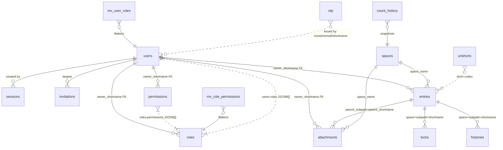

# Data model

This document covers (a) the domain vocabulary, (b) the wire shapes
clients see, (c) the PostgreSQL tables backing them, and (d) the
non-obvious encoding rules that bridge the two.

## Terminology

| Term | Meaning |
|---|---|
| **space** | Top-level business category. Permissions, schemas, and the folder tree are all scoped under a space. One row per space in the `spaces` table. |
| **subpath** | Hierarchical path inside a space that leads to an entry — e.g. `content/projects/alpha`. Stored with a leading slash in the DB, stripped on the wire. |
| **entry** | The basic coherent unit of information. Lives in the `entries` table (for most resource types) or a sibling table (users, roles, permissions, spaces, attachments). |
| **shortname** | Unique identifier differentiating an entry among its siblings (i.e. within a subpath). Client-supplied; `"auto"` triggers UUID-prefix generation. |
| **meta** | Meta information associated with the entry: `uuid`, `shortname`, `owner_shortname`, `created_at`/`updated_at`, `tags`, `displayname`, `description`, `is_active`, … |
| **payload** | The actual content associated with an entry or attachment. A JSONB column holding `{schema_shortname, content_type, body}`. |
| **schema** | An entry under the `schema` subpath that provides a JSON Schema definition. Content payloads reference it via `payload.schema_shortname` for validation. |
| **attachment** | Extra data bound to a parent entry — comments, reactions, media, JSON fragments, locks, shares, relationships, alterations. Lives in the `attachments` table. |
| **locator** | A first-class pointer to an entry — `(resource_type, space, subpath, shortname)`. Used by relationship attachments and by the permission walk's probe. |
| **acl** | Per-entry access-control list: a JSONB array of `{user_shortname, allowed_actions}` rows that grant specific users specific actions on a specific entry. |
| **permission** | A grant row listing `(actions, resource_types, subpaths, conditions, restrictions)`. Permissions are referenced by roles. |
| **role** | A named bundle of permissions. Users are assigned roles via `users.roles`. |
| **workflow** | A state-machine definition used by ticket entries to gate `state` transitions. |
| **resource_type** | Enum discriminating the entry's kind: `content`, `folder`, `schema`, `user`, `role`, `permission`, `space`, `ticket`, `data_asset`, and ~20 more. Determines which table backs the entry. |

## Entry composition

Any entry consists of four composable layers:

1. **Meta** — identity + ownership + timestamps + tags + display info.
2. **Payload** — the structured content, validated against a schema
   when `payload.schema_shortname` references a schema entry.
3. **Attachments** — zero or more attached sub-entries: comments,
   media, reactions, relationships (weak links to other entries),
   alterations (change records), locks, shares.
4. **History** — every create/update/delete writes a row to the
   `histories` table with a diff + the request's headers. The entry
   itself always refers to the latest state via
   `last_checksum_history`.

This composition lets a single logical entry carry everything that
belongs with it (binary media, reactions, relationships) without
scattering related data across unrelated rows.

## Wire envelope

Every HTTP response uses this shape:

```json
{
  "status": "success" | "failed",
  "error":  { "type": "...", "code": <int>, "message": "...", "info": [ {...} ] } | null,
  "records": [ Record, ... ] | null,
  "attributes": { "total": <int>, "returned": <int>, ... } | null
}
```

- `status` is a string literal (`"success"` or `"failed"`), not an int.
- `error` is omitted entirely on success (not `"error": null`).
- `records[]` on list endpoints; on single-entry GETs the record shape is
  spread at the top level.

A `Record` looks like:

```json
{
  "resource_type": "content",
  "uuid": "...",
  "shortname": "myentry",
  "subpath": "api/v1",             // stripped — no leading slash on the wire
  "attributes": { ... }
}
```

`InternalErrorCode` (`Models/Api/InternalErrorCode.cs`) defines the integer
codes. Selected values:

| Code | Constant | Typical type |
|---|---|---|
| 10 | `INVALID_USERNAME_AND_PASS` | auth |
| 11 | `USER_ISNT_VERIFIED` | auth |
| 17 | `INVALID_PASSWORD_RULES` | jwtauth |
| 47 | `INVALID_TOKEN` | jwtauth |
| 48 | `EXPIRED_TOKEN` | jwtauth |
| 49 | `NOT_AUTHENTICATED` | jwtauth |
| 110 | `USER_ACCOUNT_LOCKED` | auth |
| 125 | `INVALID_INVITATION` | jwtauth |
| 204 | `CANNT_DELETE` | request |
| 220 | `OBJECT_NOT_FOUND` | db / request |
| 230 | `INVALID_ROUTE` | request |
| 400 | `SHORTNAME_ALREADY_EXIST` | db |
| 404 | `SHORTNAME_DOES_NOT_EXIST` | db |
| 409 | `CONFLICT` | db |
| 430 | `SOMETHING_WRONG` | request |

`Api/FailedResponseFilter.cs` maps a subset to HTTP status codes (401 for
auth, 404 for not-found, 409 for conflicts, 423 for locks, 403 for OTP resend
blocked; everything else → 400).

## Subpath rules

The slash dance is the #1 confusion source.

| Context | Form | Example |
|---|---|---|
| Wire (`Record.subpath`) | stripped | `"api/v1"` |
| Wire (`Query.subpath`) | either — normalized on set | `"api/v1"` or `"/api/v1"` |
| Storage (`entries.subpath`, `attachments.subpath`) | leading slash | `"/api/v1"` |
| Root | `"/"` in both | `"/"` |
| Permission row `subpaths` value | **slash-free after `NormalizePermissionSubpath`** — some historical rows are stored with a leading slash; the matcher normalizes at compare time so both forms resolve. | `"items"` OR `"/items"` |

See `Models/Core/Locator.NormalizeSubpath(string)` — adds the leading slash
unless the input is empty or already `"/"`.

`Services/PermissionService.NormalizePermissionSubpath(string)` collapses
`//`, strips leading/trailing slash (unless the whole pattern is `/`).
This is the one that rescues mismatched-slash permission rows.

## Entity-relationship



## Tables (what lives where)

### `entries`

Everything that isn't a User, Role, Permission, Space, or attachment-type.
Content, Folder, Schema, Ticket, DataAsset, Alteration (those specific five
are stored **as** attachments — see below), and a few more.

Key columns:
- `uuid`, `shortname`, `space_name`, `subpath` (leading slash), `resource_type`
- `is_active`, `slug`, `displayname` (jsonb), `description` (jsonb), `tags` (jsonb)
- `payload` (jsonb) — contains `schema_shortname`, `content_type`, `body`
- `owner_shortname` (FK → users), `owner_group_shortname`, `acl` (jsonb array of `{user_shortname, allowed_actions}`)
- `relationships`, `last_checksum_history`
- `state`, `is_open`, `reporter` (jsonb), `workflow_shortname`, `collaborators`, `resolution_reason` — ticket fields
- `query_policies` (text[]) — precomputed authz LIKE patterns
- `embedding` (vector) — optional, for semantic search

Repo: `DataAdapters/Sql/EntryRepository.cs`. Mapper: `Services/EntryMapper.cs`.

### `attachments`

Specific resource types whose bytes + JSON coexist and whose parent is an
entry: `Comment`, `Reply`, `Reaction`, `Media`, `Json`, `Share`, `Lock`
(as attachment, not the `locks` table), `DataAsset`, `Relationship`,
`Alteration`.

Key columns:
- Same Metas base as `entries`
- `media` (BYTEA) — raw bytes for Media/etc.
- `body` (TEXT) — small inline text
- `parent_subpath`, `parent_shortname`, `parent_type` — binds to an entry

Repo: `AttachmentRepository.cs`.

### `users`

Management-space entries keyed by `shortname`.

Key columns:
- Metas base + `email` (ci-unique), `msisdn`, `password` (Argon2id PHC hash)
- `type` (usertype enum: `web`/`mobile`/`bot`), `language` (language enum: `ar`/`en`/`ku`/`fr`/`tr`)
- `roles` (jsonb text[]), `groups` (jsonb text[])
- `is_email_verified`, `is_msisdn_verified`, `force_password_change`
- `locked_to_device`, `device_id`, `attempt_count`, `last_login` (jsonb)
- `notes` (jsonb)
- `query_policies` (text[])

Repo: `UserRepository.cs`. Note: **two** enum mappings per `Language` and
`UserType` — the PG column stores `ar`/`en`/`ku`/`fr`/`tr` (ISO codes ← C#
member names lowercased), while the wire JSON carries `arabic`/`english`/…
(← `[EnumMember]` values). See `JsonbHelpers.EnumMember<T>` vs
`JsonbHelpers.EnumNameLower<T>`.

### `roles`

Key columns: Metas base + `permissions` (jsonb text[]).

### `permissions`

Key columns:
- Metas base
- `subpaths` — jsonb dict `{"space_name": ["subpath", ...]}`; values support
  magic words `__all_subpaths__`, and keys support `__all_spaces__`.
- `resource_types` — jsonb text[]
- `actions` — jsonb text[] (`view`, `query`, `create`, `update`, `delete`, …)
- `conditions` — jsonb text[] (`is_active`, `own`)
- `restricted_fields` — jsonb (`null` means no restriction)
- `allowed_fields_values` — jsonb

Repo: `AccessRepository.cs` (handles both roles and permissions).

### `spaces`

One row per space. The `management` space holds users/roles/permissions/
folders-for-them.

Key columns: Metas base + Space-specific (`root_registration_signature`,
`primary_website`, `indexing_enabled`, `capture_misses`, `check_health`,
`languages` (jsonb Language array), `icon`, `mirrors`, `hide_folders`,
`hide_space`, `active_plugins`, `ordinal`).

**Unique constraint:** `(shortname, space_name, subpath)` — NOT just
`shortname`. `SpaceRepository.UpsertAsync` uses that tuple on conflict.

### `sessions`

One row per (user, access token) pair. Columns: `shortname`, `access_token`
(stored verbatim for `session_inactivity_ttl` checks), `last_used_at`,
`firebase_token`. Used by JwtBearerSetup for session-based inactivity
enforcement.

### `invitations`

Single-use JWT-backed invitations. Columns: `shortname`, `invitation`
(the JWT), `expires_at`. See [auth.md](./auth.md).

### `histories`

Change log. Every create/update/delete writes a row with `event_shortname`,
`diff`, `request_headers`.

### `locks`, `otp`, `urlshorts`, `count_history`

Straightforward single-purpose tables. See their repos for columns.

### Materialized views

- `mv_user_roles` — `(user_shortname, role_shortname)` flattened from `users.roles`
- `mv_role_permissions` — `(role_shortname, permission_shortname)` flattened from `roles.permissions`

Both have UNIQUE indexes so `REFRESH MATERIALIZED VIEW CONCURRENTLY` works.
`AuthzCacheRefresher.RefreshAsync` runs them after every user/role/permission
write and at boot.

## Non-obvious storage rules (discovered the hard way)

These are documented here so you don't relitigate them.

### `JsonStringEnumConverter` ignores `[EnumMember]` under source-gen

Don't set `UseStringEnumConverter` on `JsonSourceGenerationOptions`. Use the
custom `EnumMemberConverterBase<T>` in `Models/Json/EnumMemberConverter.cs`
with one concrete subclass per enum. Each enum has `[JsonConverter(typeof(...))]`.

### Two mappings for `Language` and `UserType`

- Wire: `arabic`, `english`, `kurdish`, `french`, `turkish` (`[EnumMember]`)
- DB enum column: `ar`, `en`, `ku`, `fr`, `tr` (lowercased C# member name)

`UserRepository` casts via `$22::usertype` and `$23::language` in the SQL.

### NOT NULL JSONB columns default to empty

`tags`, `roles`, `groups`, `permissions`, `subpaths`, `resource_types`,
`actions`, `conditions`, `languages` all reject NULL. `JsonbHelpers.ToJsonbList(null)`
returns `"[]"` and `ToJsonbDict(null)` returns `"{}"`.

### `filter_schema_names=["meta"]` is a sentinel, not a filter

`Query.filter_schema_names` defaults to `["meta"]` on the wire.
`QueryHelper.BuildWhereClause` strips the literal `"meta"` and only emits a
SQL filter for the remainder. Internal callers that want all schemas must
pass `FilterSchemaNames = new()` (empty list).

### `source-gen JSON` misbehaves with `object` values

A `Dictionary<string, object>` sent through source-gen fails when a value's
runtime type isn't registered. `long` fails (Postgres `COUNT(*)` returns it)
— cast to `int` before adding. `string[]` fails — use `List<string>`.
`JsonElement` needs to be registered explicitly. Polymorphic `object` is
the hardest AOT path.

### Source-gen JSON ignores C# property initializers

`public bool RetrieveTotal { get; init; } = true;` silently flips to
`false` when the incoming JSON omits the key. Any field with a non-`default(T)`
initializer must be nullable (`bool?`), with the consumer treating `null` as
the intended default.

### `DefaultIgnoreCondition` in the source-gen attribute doesn't carry over

`[JsonSourceGenerationOptions(DefaultIgnoreCondition = WhenWritingNull)]`
drives TypeInfo metadata, but not `SerializerOptions` at runtime. Must also
set `o.SerializerOptions.DefaultIgnoreCondition = WhenWritingNull` in
`ConfigureHttpJsonOptions` or nulls leak onto the wire.

### Timestamp Kind matters

Postgres `timestamp without time zone` + Npgsql 6+ rejects `DateTime.UtcNow`
(Kind=Utc). **First line of `Program.cs`:**
`AppContext.SetSwitch("Npgsql.EnableLegacyTimestampBehavior", true)`.

### Resource-type → repository dispatch

See `RequestHandler.cs:Dispatch{Create,Update,Delete}Async`:

| `ResourceType` | Table / repo |
|---|---|
| `User` | `users` / UserRepository |
| `Role` | `roles` / AccessRepository.Upsert/DeleteRoleAsync |
| `Permission` | `permissions` / AccessRepository.Upsert/DeletePermissionAsync |
| `Space` | `spaces` / SpaceRepository |
| `Comment`, `Reply`, `Reaction`, `Media`, `Json`, `Share`, `Lock`, `DataAsset`, `Relationship`, `Alteration` | `attachments` / AttachmentRepository |
| everything else (`Content`, `Folder`, `Schema`, `Ticket`, `PluginWrapper`, …) | `entries` / EntryService → EntryRepository |

Get this wrong and you'll silently no-op — Role/Permission updates used
to fall through to `EntryService` and do nothing until commit 8cbb999.

### Resource types by category

A quick orienting map. The exhaustive enum lives in
`Models/Enums/ResourceType.cs`; this table just groups it by intent.

| Category | Members |
|---|---|
| Core (security + structure) | `space`, `folder`, `user`, `role`, `permission`, `group` |
| Data | `content`, `schema`, `json`, `file`, `media` |
| Social / interaction | `post`, `comment`, `reply`, `reaction`, `share` |
| Workflow | `ticket` |
| System / auditing | `log`, `notification`, `plugin_wrapper`, `history`, `lock`, `alteration` |
| Analytics / big-data | `parquet`, `csv`, `jsonl`, `sqlite`, `data_asset` |
| Relationships | `relationship` |

## `/managed/request` supported actions

One unified endpoint, multiple actions. `RequestType` lives in
`Models/Enums/RequestType.cs`; the dispatch is in
`Api/Managed/RequestHandler.cs`. On a failure inside a multi-record
batch, the response carries the aggregate envelope described in
[contributing.md](./contributing.md).

| `request_type` | What it does |
|---|---|
| `create` | Insert a new entry (User/Role/Permission/Space/entries/attachments routed per the dispatch table above). Auto-generates UUIDs when `"shortname":"auto"`. |
| `update` | Full-or-partial write. Every wire-visible attribute is patched; omitted fields keep their stored value. |
| `patch` | Alias of `update` with partial semantics (wire-compat). |
| `delete` | Remove the entry + clean up attachment payloads / cascade effects. Protected rows (the management space itself) refuse with `CANNT_DELETE`. |
| `move` | Re-parent an entry to a different `(space, subpath)` or rename it. Rewrites `attachments.parent_subpath` + history pointers. |
| `assign` | Change the entry's collaborators list (see `Entry.Collaborators`). |
| `update_acl` | Replace the per-entry ACL JSONB array without touching other fields. |

## Where to go next

- How queries filter these tables → [query.md](./query.md)
- How permissions gate them → [permissions.md](./permissions.md)
