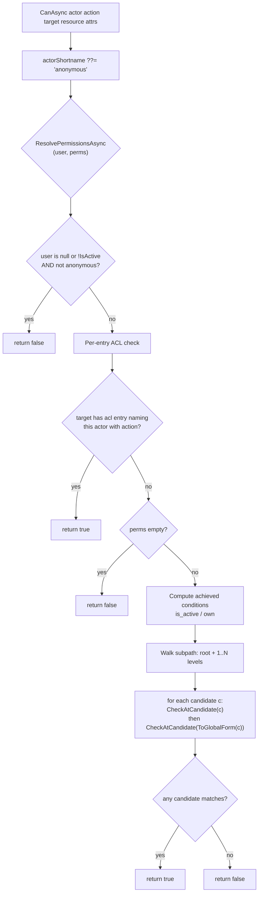
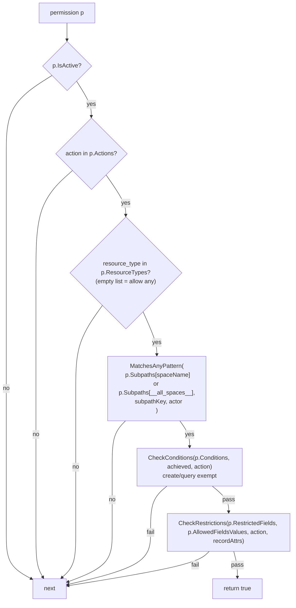
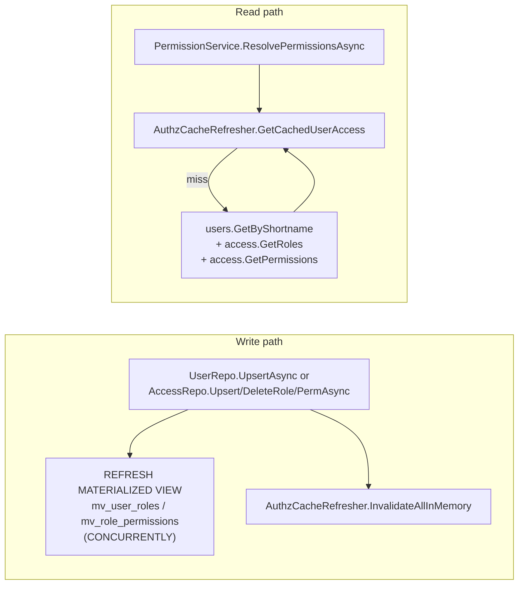

# Permissions

The permission system is where 80% of "why is this returning nothing / a 403 /
the wrong entries?" debugging ends up. Read this carefully.

Single entry point: `Services/PermissionService.CanAsync`. Everything else
in the API (`CanReadAsync`, `CanCreateAsync`, `CanUpdateAsync`, `CanDeleteAsync`,
`CanQueryAsync`, `HasAnyAccessToSpaceAsync`, `GetAccessibleSpacesAsync`) calls
into `CanAsync` or reads the same resolved permission set.

## The mental model

A permission **grants** `(action, subpath_pattern, resource_type)` against
a `(space, condition_set, restrictions)` scope. A user has access via
`user → roles → permissions`. Anonymous is the special shortname
`"anonymous"` + an optional `"world"` permission.

## The walk (decision tree)



### `CheckAtCandidate`

For each permission `p` in the resolved set:



## Anonymous + `world`

The contract is strict: for an anonymous caller to see anything at all,

1. A user row with shortname `"anonymous"` must exist.
2. That user must have **at least one role** in `users.roles`.
3. Either that role's `permissions` list covers the target, OR a permission
   row with shortname `"world"` exists and gets folded in — `world` is
   appended to each role's permission set during resolution, so a zero-role
   anonymous user gets nothing even if `world` is defined.

Fails seen in practice:
- No anonymous user → CanAsync returns false silently → `/public/query`
  returns `{total:0}`.
- Anonymous user exists but `roles=[]` → `world` never consulted → same
  outcome.
- `world.subpaths.<space>` stored as `["/foo", "/bar"]` (leading slashes) —
  the matcher normalizes both sides via `NormalizePermissionSubpath`, so
  `/foo` matches the walk key `foo`.

Verify on a live DB:

```sql
-- 1. Does anonymous exist and is it active?
SELECT shortname, is_active, roles FROM users WHERE shortname='anonymous';

-- 2. For each role the anonymous user has, list its permissions.
SELECT r.shortname AS role, r.is_active, r.permissions
FROM roles r, jsonb_array_elements_text(
            (SELECT roles FROM users WHERE shortname='anonymous')
              ) AS t(role_name)
WHERE r.shortname = t.role_name;

-- 3. Every permission reachable from anonymous + the special "world".
WITH anon_perms AS (
    SELECT DISTINCT p_name
    FROM users u
             CROSS JOIN LATERAL jsonb_array_elements_text(u.roles) AS role_name
    JOIN roles r ON r.shortname = role_name
    CROSS JOIN LATERAL jsonb_array_elements_text(r.permissions) AS p_name
WHERE u.shortname='anonymous'
UNION
SELECT 'world'
    )
SELECT p.shortname, p.is_active, p.subpaths, p.resource_types, p.actions
FROM permissions p
         JOIN anon_perms a ON p.shortname = a.p_name;
```

## Magic words

| Keyword | Where | Meaning |
|---|---|---|
| `__all_spaces__` | `p.Subpaths` **key** | any space name matches |
| `__all_subpaths__` | `p.Subpaths[space]` **value** | any subpath key matches during the walk |
| `__current_user__` | `p.Subpaths[space]` value | replaced with the caller's shortname before match (e.g. `people/__current_user__/protected`) |

See `PermissionService.ToGlobalForm` — replaces the second-to-last segment
of a candidate with `__all_subpaths__`, so each walk step also probes
against permissions that use the wildcard.

## Subpath walk

For `target.Subpath = "/projects/alpha/beta"`:

```
"/"                          ← root always checked first
"projects"                   ← first segment
"projects/alpha"
"projects/alpha/beta"        ← full path
```

And for each candidate, the matcher ALSO probes its "global form"
(`ToGlobalForm`):

```
"/"                    → __all_subpaths__
"projects"             → __all_subpaths__
"projects/alpha"       → __all_subpaths__/alpha  (replaces 2nd-to-last)
"projects/alpha/beta"  → projects/__all_subpaths__/beta
```

Walk + global form = 8 match attempts per permission per probe. For a
`Folder` resource with an entry shortname, the folder's shortname is also
appended so a permission keyed on `"users"` grants access to the folder
entry `{subpath="/", shortname="users"}`.

Implementation: `PermissionService.BuildSubpathWalk`, `ToGlobalForm`,
`CheckAtCandidate`, `MatchesAnyPattern`, `NormalizePermissionSubpath`.

## Per-entry ACL (overrides roles)

Any entry can carry an `acl` JSONB array of `{user_shortname, allowed_actions}`.
If the caller appears with the requested action, the walk short-circuits
at step 1 — role-based permissions don't need to approve.

Shape on the wire:

```json
{ "acl": [
  {"user_shortname": "alice", "allowed_actions": ["view", "update"]},
  {"user_shortname": "bob",   "allowed_actions": ["view"]}
] }
```

## Granting roles & groups (`grantable_by`) and the privilege floor

Roles and groups are **first-class tables** (`roles`, `groups`), each carrying a
`grantable_by` JSONB list. `EnforcePrivilegeFloorAsync`
(`Api/Managed/RequestHandler.cs`) gates a NON-global-admin going through
`/managed/request`:

- **Assigning** a role/group to a user (`attributes.roles` / `attributes.groups`)
  is allowed only when that role/group's `grantable_by` lists a role/group the
  actor already holds. Each type checks **its own kind**: a role's `grantable_by`
  is matched against the actor's roles
  (`PermissionService.NonGrantableRolesAsync`), a group's against the actor's
  groups (`NonGrantableGroupsAsync`). An inactive, missing, or
  null/empty-`grantable_by` grantee is non-grantable — only a global admin can
  assign it. Holding a role/group no longer implies the right to grant it.
- **Setting** `grantable_by` (or a role's `permissions`, or a permission's
  scope) is global-admin-only.

A global admin — a grant of every action over `__all_spaces__` /
`__all_subpaths__` — bypasses the floor entirely.

**Design boundaries (intentional, not gaps):**

- **Same-type delegation only.** A role's `grantable_by` lists roles; a group's
  lists groups. There is no cross-type delegation (no "holders of role X may grant
  group Y"). This is the permanent model — gating a group on role membership would
  need a separate mechanism, deliberately out of scope.
- **No nesting / transitivity.** Groups are flat (a group is not a member of
  another group) and `grantable_by` is a single hop — "A can grant B, B can grant
  C" does **not** imply A can grant C. Mirrors Python.
- **Inactive grantees are non-grantable, but ownership is not revoked.** The
  delegation predicate filters inactive roles/groups, so deactivating a group
  stops *new* assignments; existing `own`-via-`user.groups` resolution is
  unaffected (it reads the string list regardless of active state). The two
  consumers of "group" diverge here by design.

### Migration / backfill: groups promoted to a first-class table

The `groups` table is **new** (added with `grantable_by`); there is **no
automatic backfill** from the pre-existing free-form `user.groups` string lists.
Consequences on upgrade:

- **Ownership ACLs are unaffected.** The `own` condition still resolves group
  membership off the `user.groups` string list
  (`PermissionService.cs`, the `own` rule above), which does not join the
  `groups` table.
- **Group *assignment* by non-admins stops working** until the table is
  populated. Every group a user currently references has no `groups` row, so its
  `grantable_by` is effectively null → only a global admin can assign it.

To restore non-admin delegation, insert a `groups` row for each distinct group
shortname your users reference, active, with the intended `grantable_by`. The
distinct names are discoverable from the user rows:

```sql
-- list group shortnames in use that have no backing groups row
SELECT DISTINCT g AS shortname
FROM users, jsonb_array_elements_text(COALESCE(groups, '[]'::jsonb)) AS g
WHERE g NOT IN (SELECT shortname FROM groups);
```

Create each via `POST /managed/request` (`resource_type: "group"`, as a global
admin) so `query_policies` is generated and caches refresh — setting
`grantable_by` to the group(s) whose members should be able to assign it.

## Conditions

`p.Conditions` is a list of required flags that the **resource** must have
achieved for the grant to apply:

| Condition | Achieved when |
|---|---|
| `is_active` | `resource.IsActive == true` |
| `own` | `resource.OwnerShortname == actor` OR `resource.OwnerGroupShortname` is in `user.Groups` |

**Exception:** `create` and `query` actions are exempt from condition
checks. The rationale: you can't ask "is the entry active" before it
exists (create), and query results are filtered post-hoc at the SQL
level.

This is why `CanQueryAsync` tries `"view"` first, then `"query"`:

```csharp
if (await perms.CanAsync(actor, "view", probe, ct: ct)) return true;
if (await perms.CanAsync(actor, "query", probe, ct: ct)) return true;
return subpath == "/" && await perms.HasAnyAccessToSpaceAsync(actor, spaceName, ct);
```

A `conditions:["is_active"]` permission without a loaded resource FAILS
the `view` check but PASSES the `query` check via the exemption. Critical
for anonymous + world: the `world` permission almost always carries
`is_active` as a condition.

## Restrictions (field-level)

`p.RestrictedFields` + `p.AllowedFieldsValues` narrow **create** and **update**
to a specific payload shape. If `restricted_fields` lists `["payload.body.price"]`,
any patch touching `price` is denied. `allowed_fields_values` is a dict
of `{field: [permitted values]}` — analogous to an enum whitelist.

See `CheckRestrictions` (internal).

## SQL-level ACL filter

`/managed/query` and `/public/query` don't just gate at the service layer —
they also apply a WHERE clause that scopes results to entries the caller
is allowed to see. `QueryHelper.AppendAclFilter` emits:

```sql
AND (owner_shortname = $N
OR EXISTS (SELECT 1 FROM jsonb_array_elements(acl) AS elem
WHERE elem->>'user_shortname' = $N
AND (elem->'allowed_actions') ? 'query')
OR EXISTS (SELECT 1 FROM unnest(query_policies) AS qp
WHERE qp LIKE $M ESCAPE '\\'))
```

The `query_policies` text[] is the **precomputed** authz filter —
`Services/QueryPolicyHelper` walks the user's
permissions and generates `space:subpath:resource_type:is_active:owner` LIKE
patterns. Every entry's `query_policies` column holds its own set of
patterns. Intersection happens at SQL, so we never round-trip large lists.

**The SQL ACL filter only runs when `userShortname` is passed to
`QueryHelper.RunQueryAsync`.** `EntryRepository.QueryAsync(Query)` does NOT
pass it — the service-level `CanQueryAsync` gates access before we get here.
For anonymous queries, `CanQueryAsync` is the ONLY gate.

## Caching



- `AuthzCacheRefresher` is singleton-scoped. In-memory dict keyed by
  `actorShortname`, value is `CachedUserAccess(User?, List<Permission>)`.
- `User?` (nullable) — needed for anonymous when no DB row exists.
- Invalidated on every user/role/permission write. Process-local: **no
  cross-instance invalidation.** Multi-node deployments need a shared
  cache or a pub/sub invalidator (not yet implemented).

## Where this lives in code

| Responsibility | File |
|---|---|
| Public API (`CanReadAsync`, etc.) | `Services/PermissionService.cs` |
| The core decision logic | `Services/PermissionService.cs::CanAsync` |
| Subpath walk + global form | `BuildSubpathWalk`, `ToGlobalForm` |
| Pattern matching | `MatchesAnyPattern`, `NormalizePermissionSubpath` |
| Conditions / restrictions | `CheckConditions`, `CheckRestrictions` |
| User-access resolution + cache | `ResolvePermissionsAsync` + `AuthzCacheRefresher` |
| SQL-level ACL filter | `DataAdapters/Sql/QueryHelper.cs::AppendAclFilter` |
| `query_policies` column filler | `Services/QueryPolicyHelper.cs` |
| MV refresh on write | `AuthzCacheRefresher.RefreshAsync` |
| Public endpoints that rely on all of this | `Services/QueryService.cs::CanQueryAsync` |

## Internal-visible helpers

`[InternalsVisibleTo("dmart.Tests")]` (in `GlobalUsings.cs` at project root)
exposes `BuildSubpathWalk`, `ToGlobalForm`, `CheckConditions`,
`CheckRestrictions`, `MatchesAnyPattern`, `NormalizePermissionSubpath`,
`FlattenAttrs` to the test project. Tests in
`dmart.Tests/Unit/Services/PermissionServiceTests.cs` pin the fine-grained
contract.

## Debugging a permission decision

1. Reproduce the HTTP call with a known actor.
2. SQL: dump the actor's user row, their roles (via `mv_user_roles`),
   their reachable permissions (via `mv_role_permissions` + direct
   `users.roles`), and any `world` permission.
3. Walk by hand: for `target.Subpath = "/foo/bar"`, candidates are
   `/`, `foo`, `foo/bar`. For each, try the permission's `subpaths[space]`
   (normalized) AND `subpaths[__all_spaces__]` (normalized).
4. Check action, resource_type, conditions.
5. If CanAsync returns true but you still see 0 results: SQL-level ACL
   might be filtering. Dump the entry's `query_policies` and the user's
   policies.

## Test coverage

- `dmart.Tests/Unit/Services/PermissionServiceTests.cs` — pure matcher tests.
- `dmart.Tests/Integration/PermissionServiceIntegrationTests.cs` — DB-backed
  walk scenarios.
- `dmart.Tests/Integration/PublicQueryAnonymousTests.cs` — full HTTP flow
  with over- and under-access world permission boundaries.

Both test classes share `[Collection(AnonymousWorldCollection.Name)]` so
they serialize (they mutate the reserved `anonymous`/`world` rows).
