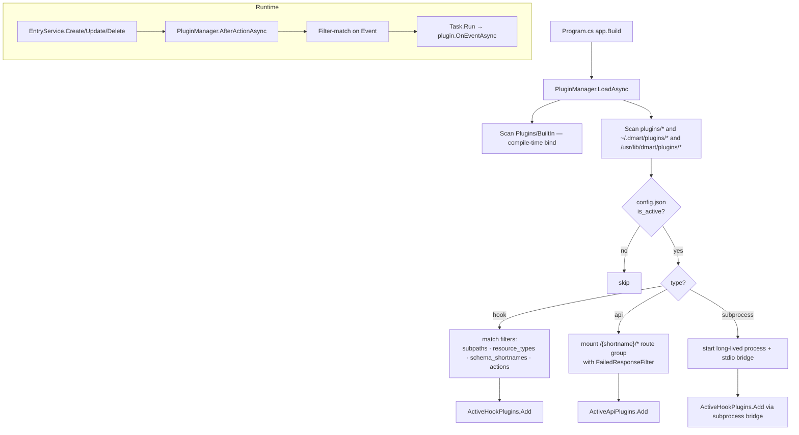
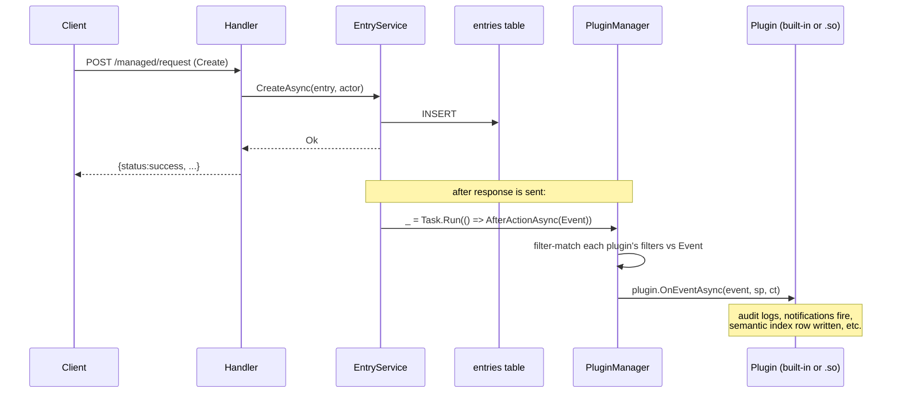
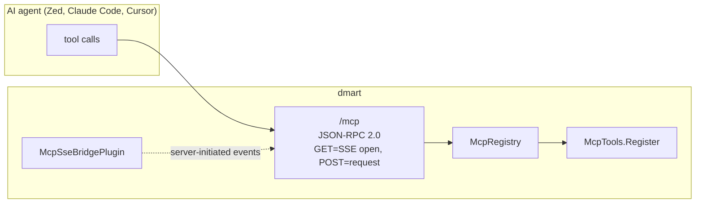
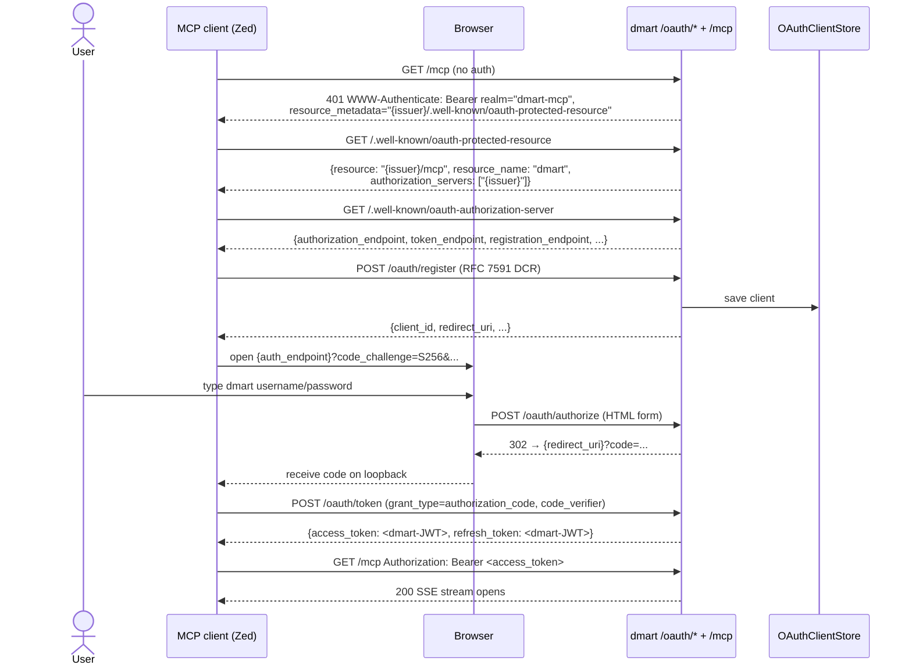

# Plugins and MCP

Two loosely-coupled extension surfaces:

- **Plugins** — internal extensions that hook into the dmart lifecycle
  (after-action events) or mount new HTTP routes (`/{plugin_shortname}/*`).
- **MCP** — Model Context Protocol server exposing dmart as a tool surface
  to AI agents (Zed, Claude Code, Cursor, etc.).

## Plugins

### Types

| Kind | Contract | Fires on |
|---|---|---|
| Hook | `IHookPlugin` → `OnEventAsync(Event, IServiceProvider, CancellationToken)` | After CRUD on an entry (create/update/delete/move + attachments) |
| API | `IApiPlugin` → `MapRoutes(RouteGroupBuilder)` | HTTP request to `/{shortname}/*` |

Both interfaces live in `Plugins/IHookPlugin.cs` / `Plugins/IApiPlugin.cs`.

### Discovery + filter matching



### Built-in plugins (compiled in)

| Plugin | Purpose |
|---|---|
| `resource_folders_creation` | Creates default `/schema` folder when a new Space is created. Without it, first schema upload fails. |
| `realtime_updates_notifier` | Publishes CRUD events to the WebSocket channel manager. |
| `audit` | INFO-log every dispatched event. Useful as a development sanity check. |
| `mcp_sse_bridge` | Fans CRUD events out to active MCP SSE sessions. `always_active` — filter is ignored. |
| `semantic_indexer` | When embedding API is configured, embeds payload.body on create/update. |
| `db_size_info` | API plugin at `GET /db_size_info/`. Returns per-table size. |

All live in `Plugins/BuiltIn/`. They subscribe by implementing the interface
and adding themselves to DI — `PluginManager` discovers them via
`IEnumerable<IHookPlugin>` / `IEnumerable<IApiPlugin>` injection.

### External plugin config

Each plugin directory has:

```
~/.dmart/plugins/my_plugin/
├── config.json
└── my_plugin.so    (hook or api: loaded via dlopen)
└── my_plugin       (subprocess: forked, stdio JSON-RPC)
```

`config.json` shape:

```json
{
  "shortname": "my_plugin",
  "is_active": true,
  "type": "hook",                     // or "api" or "subprocess"
  "listen_time": "after",
  "filters": {
    "subpaths": ["__ALL__"],
    "resource_types": ["content"],
    "schema_shortnames": ["__ALL__"],
    "actions": ["create", "update", "delete"]
  }
}
```

### Native `.so` ABI

Exported C functions:

```c
char* get_info();             // returns JSON {shortname, version, type}
char* hook(const char* evt);  // for hook type; returns JSON response
char* handle_request(const char* req); // for api type
void free_string(char* ptr);  // dmart calls this after reading the string
```

See `custom_plugins_sdk/` for working C#, Rust, and Go examples. The loader
is `Plugins/Native/NativePluginLoader.cs` — uses `dlopen` + `dlsym`.

### Plugin lifecycle for hooks



Key: **plugins fire AFTER the HTTP response** — `Task.Run(...)` is used so
a slow plugin can't slow the client. Errors are logged but swallowed; they
don't fail the request.

### Plugin cache invalidation

Spaces have an `active_plugins` list. When a Space row changes, the manager
invalidates its per-space plugin cache
(`PluginManager.InvalidateSpaceCache`) so hooks from a newly-added plugin
fire for the next event.

## MCP (Model Context Protocol)

Exposes dmart as a tool surface to AI agents. Transport:
`GET/POST /mcp` (JSON-RPC 2.0 over HTTP or SSE). OAuth 2.1 for delegated
auth so agents can log in as a dmart user without manual JWT paste.

### Protocol surface



### Tools (live)

`Api/Mcp/McpTools.cs` registers each tool name:

- `dmart_me` — caller identity + permission summary
- `dmart_query` — forward to `QueryService`
- `dmart_get_entry` — single-entry fetch
- `dmart_create` / `dmart_update` / `dmart_delete` — CRUD
- `dmart_semantic_search` — when embedding API is configured
- … (see `McpTools.cs` for the current list)

**Tool names use underscore, not dot.** Anthropic's tool-use API enforces
`^[a-zA-Z0-9_-]{1,128}$` and rejects dots with HTTP 400, even though the
MCP spec allows them.

### OAuth 2.1 discovery chain

Triggered by the MCP client when it gets HTTP 401 with a `WWW-Authenticate`
header pointing at the resource metadata.



Non-obvious:

- `JWT_ISSUER` in config.env drives every discovery URL composition via
  `OAuthEndpoints.GetIssuerUrl`. No forwarded-headers middleware needed.
- `JwtBearerSetup.OnChallenge` emits
  `WWW-Authenticate: Bearer realm="dmart-mcp", resource_metadata="..."`
  **only on 401 from `/mcp*` paths** — this is the trigger.
- `OAuthEndpoints.ProtectedResourceMetadata` emits
  `resource: {issuer}/mcp` (not bare issuer) + `resource_name: "dmart"`.
- HTML login form `<form action="">` (relative). Critical for path-base
  deployments (e.g. `https://host.example/dmart`).
- `OAuthClientStore` is currently in-memory — DCR registrations are lost
  on restart. Deferred hardening: port to a `DataAdapters/Sql` table
  (pattern exists in `InvitationRepository`).

### SSE bridge for notifications

`Plugins/BuiltIn/McpSseBridgePlugin` is an `IHookPlugin` with
`always_active`. It subscribes to every dmart CRUD event and fans the
event out to active MCP sessions as JSON-RPC
`notifications/resources/updated` — scoped by each session's
`CanReadAsync` permission filter before delivery.

Session state (outbox, capabilities, elicitation requests):
`Api/Mcp/McpSession.cs`. Bounded 256-slot outbox with `DropOldest`
policy — slow clients don't block the fan-out.

### Elicitation

When the MCP client advertises `capabilities.elicitation` at initialize,
`dmart.delete` sends a server→client request over SSE and awaits the
response (≤ 2 minutes) via a `TaskCompletionSource` keyed by request id.
Client response lands on POST `/mcp`; accept → proceed, decline →
cancelled envelope.

### Deploying behind a reverse proxy

See `admin_scripts/docker/notes.sh` and the MCP-plan memory for a Caddy
configuration. Key pieces:

- `handle_path /dmart/*` to strip the prefix before forwarding.
- `flush_interval -1` on the reverse-proxy directive for SSE.
- Two extra `handle` blocks for RFC 8414 path-aware `.well-known` URLs
  (`/.well-known/oauth-authorization-server/dmart` +
  `/.well-known/oauth-protected-resource/dmart` → rewrite + forward to
  dmart).
- `JWT_ISSUER="https://host.example/dmart"` so discovery URLs resolve.

### MCP code map

| Concern | File |
|---|---|
| HTTP transport (GET=SSE, POST=request) | `Api/Mcp/McpEndpoint.cs` |
| Session state | `Api/Mcp/McpSession.cs` |
| Tool registry | `Api/Mcp/McpRegistry.cs` |
| Tool implementations | `Api/Mcp/McpTools.cs` |
| Resource resolver | `Api/Mcp/McpResourceResolver.cs` |
| Elicitation round-trip | `Api/Mcp/McpElicitation.cs` |
| JSON-RPC frames | `Api/Mcp/McpProtocol.cs` + `McpJsonContext.cs` |
| OAuth AS endpoints | `Api/Oauth/OAuthEndpoints.cs` |
| SSE-side plugin | `Plugins/BuiltIn/McpSseBridgePlugin.cs` |

## Plugin code map

| Concern | File |
|---|---|
| Plugin manager | `Plugins/PluginManager.cs` |
| Hook interface | `Plugins/IHookPlugin.cs` |
| API interface | `Plugins/IApiPlugin.cs` |
| Built-in plugins | `Plugins/BuiltIn/*.cs` |
| Native `.so` loader | `Plugins/Native/NativePluginLoader.cs` |
| Subprocess runner | `Plugins/Native/SubprocessPluginRunner.cs` |
| SDK + samples | `custom_plugins_sdk/` |
