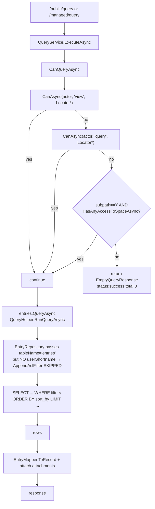

# Queries

`/managed/query` (auth-required) and `/public/query` (anonymous-allowed)
both accept the same `Query` body and route through `Services/QueryService`.
This doc covers the wire fields, the types, the search syntax, sort_by,
and where ACL filtering happens.

## The `Query` body

```json
{
  "type": "search" | "subpath" | "spaces" | "aggregation" | "tags" | "counters" | "history" | "events" | "random" | "attachments_aggregation" | "attachments",
  "space_name": "evd",
  "subpath": "items",           // wire accepts either form, normalized to "/items" internally
  "exact_subpath": false,       // true = only at this subpath, not descendants
  "filter_types": [],           // ResourceType[] narrowing (content, folder, user, ...)
  "filter_schema_names": [],    // if ["meta"] → treated as sentinel "no filter"; Pydantic default
  "filter_shortnames": [],      // shortname IN (...)
  "filter_tags": [],            // tags ?| (...)
  "search": "query string",     // RediSearch-style; see below
  "from_date": "2024-01-01",
  "to_date":   "2024-12-31",
  "sort_by":   "payload.body.rank, shortname",
  "sort_type": "ascending",     // or "descending"
  "retrieve_json_payload": true,
  "retrieve_attachments": true,
  "retrieve_lock_status": false,
  "limit": 1000,                // clamped to settings.MaxQueryLimit
  "offset": 0,
  "retrieve_total": true,       // null = default (true); send false to skip the COUNT(*)
  "include_fields": [],         // trim Record.attributes
  "exclude_fields": [],
  "highlight_fields": {},
  "validate_schema": true,
  "aggregation_data": { ... },  // for type=aggregation — see below
  "join": [ ... ]               // join queries — see below
}
```

## Query types

| `type` | Target | Returns |
|---|---|---|
| `search` / `subpath` | entries table under `{space_name}/{subpath}` | Record[] |
| `spaces` | spaces listing | Space records filtered by access |
| `attachments` | attachments of one parent subpath | Attachment records |
| `tags` | distinct tag counts | records with tag counts |
| `aggregation` | entries + `aggregation_data` (GROUP BY + reducers) | aggregated rows |
| `attachments_aggregation` | same but over attachments | same |
| `counters` | COUNT only (no records) | `{total, returned:0, records:[]}` |
| `history` | histories table | change log rows |
| `events` | JSONL file at `{space}/.dm/events.jsonl` | event rows (file-based, not SQL) |
| `random` | random N entries | records with `ORDER BY RANDOM()` |

Dispatch: `QueryService.ExecuteAsync` → one of `QuerySpacesAsync`,
`QueryEntriesAsync`, `QueryAttachmentsAsync`, `QueryTagsAsync`,
`QueryAggregationAsync`, `QueryCountersAsync`, `QueryEventsAsync`.

Under `QueryEntriesAsync`, the `space_name == management` case routes
`/users` to `QueryUsersAsync`, `/roles` to `QueryRolesAsync`,
`/permissions` to `QueryPermissionsAsync` so management-space queries hit
the right table.

## Search syntax (RediSearch-style)

Accepted in `search` string. Implementation: `QueryHelper.ParseSearchExpression`
+ `AppendSearchClauses`.

| Pattern | SQL effect |
|---|---|
| `word` | plain text → `ILIKE` across shortname, payload, displayname, description, tags |
| `@field:value` | exact match on a column or jsonb path |
| `@payload.body.k:v` | type-aware jsonb path |
| `@payload.*:v` | wildcard — `(payload::jsonb)::text ILIKE '%v%'` |
| `@payload.body.*:v` | wildcard under `body` |
| `-@field:value` | negation — `!=` or `NOT` |
| `@field:v1\|v2` | OR values — `(field=v1 OR field=v2)` |
| `-@field:v1\|v2` | negation + OR → DeMorgan'd AND |
| `@field:>N`, `>=`, `<`, `<=` | numeric comparison on payload values |
| `@field:[min max]` / `[min,max]` | BETWEEN range |
| `-@field:[min max]` | `NOT BETWEEN` |
| `@field:*` | existence — `field IS NOT NULL` |
| `-@field:*` | absence — `field IS NULL` |
| `@tags:x`, `@roles:x`, `@groups:x` | `@>` jsonb containment |
| `(expr1) (expr2)` | OR between parens groups, AND within |
| `expr1 and expr2` | `and` keyword is ignored — AND is the default when no operator |

Type detection on values:
- `true`/`false` → boolean cast
- numeric → `::float` cast + jsonb `number` type check
- otherwise → string (exact jsonb string match, or substring on wildcards)

Coverage: 50+ unit tests in `dmart.Tests/Unit/Services/QueryHelperTests.cs`
pin the emitted SQL shape for every combination.

## sort_by

Fully Python-parity via `QueryHelper.BuildOrderClauseBody`:

- `null` → `ORDER BY updated_at <DESC|ASC>`
- bare column name → validated against a per-table whitelist
  (`SharedSortColumns` + `TableSortColumns`), unknown columns fall back
  to `updated_at`
- JSON path (contains `.`) → transformed to `payload::jsonb -> 'body' ->> 'rank'`
  with a `CASE WHEN expr ~ '^-?[0-9]+(\.[0-9]+)?$' THEN (expr)::float END`
  wrap so numeric values sort numerically (1, 2, 10) — matches Python's
  `adapter.py::set_sql_statement_from_query`
- Comma-separated list → each token handled independently, emitted as
  `expr1 <dir>, expr2 <dir>` for multi-column sort

Accepted token forms:

| Wire | Resolved |
|---|---|
| `shortname` | `shortname` |
| `created_at` | `created_at` |
| `attributes.shortname` | `shortname` (prefix stripped) |
| `payload.body.rank` | `payload::jsonb -> 'body' ->> 'rank'` + numeric CASE wrap |
| `body.rank` | `payload::jsonb -> 'body' ->> 'rank'` (sugar for `payload.body.rank`) |
| `@payload.body.rank` | same, with `@` stripped |
| `payload.body.rank, shortname` | both, primary + tiebreaker |

Safety: each path segment is validated against
`^[A-Za-z_][A-Za-z0-9_]*$`. Unsafe segments drop the token silently.
If every token fails to resolve, falls back to `updated_at`.

## Pagination

- `limit` — defaults to 100 when ≤ 0. Hard cap: `settings.MaxQueryLimit`
  (default 10,000).
- `offset` — passed through.
- `attributes.total` and `attributes.returned` in the response.
  `retrieve_total: false` skips the `COUNT(*)` roundtrip and sets
  `total = -1`.

## ACL filtering (where it happens)



**Important:** the SQL-level ACL filter only fires when the repo receives
`userShortname`. `EntryRepository.QueryAsync(Query)` doesn't pass it —
the service-level `CanQueryAsync` is the gate. For the SQL-level filter,
see `AccessRepository.QueryRolesAsync` / `QueryPermissionsAsync` paths
and `/info/*` management-scoped queries — those use the full
`RunQueryAsync(..., userShortname: actor, tableName: "roles", queryPolicies: ...)`
overload that appends `AppendAclFilter`.

Background on the filter: `QueryHelper.AppendAclFilter` emits a WHERE
condition that accepts the row if ANY of:
- `owner_shortname = actor`
- `acl` array has an entry for actor with the `query` action
- `query_policies` column (LIKE-pattern precomputed authz) matches one
  of the user's computed policies (space:subpath:resource_type:is_active:owner)

See [permissions.md](./permissions.md) for the precomputed `query_policies`
story.

## Aggregation

`type: "aggregation"` + `aggregation_data`:

```json
{
  "type": "aggregation",
  "space_name": "evd",
  "subpath": "/",
  "aggregation_data": {
    "group_by": ["@resource_type", "@payload.body.category"],
    "reducers": [
      { "reducer_name": "count", "args": [], "alias": "n" },
      { "reducer_name": "sum", "args": ["@payload.body.price"], "alias": "total_price" },
      { "reducer_name": "avg", "args": ["@payload.body.rating"], "alias": "avg_rating" }
    ],
    "load": []
  }
}
```

Supported reducers (`QueryHelper.MapReducerToSql`): `count`, `sum`, `avg`,
`min`, `max`. Each group-by and arg can be a bare column (`@resource_type`)
or a jsonb path (`@payload.body.foo`). Same sanitation as sort_by.

## Joins (client-side)

`Query.join` is a Python-parity field. When present, the main query runs
first; for each result the join queries run (against the same or
different space/subpath). Current C# port has the field bound for
shape-parity and the join logic implemented in
`QueryService.ApplyClientJoinsAsync` for the common case.

## Response shape

```json
{
  "status": "success",
  "records": [
    {
      "resource_type": "content",
      "uuid": "...",
      "shortname": "alpha",
      "subpath": "items",
      "attributes": {
        "payload": { "content_type": "json", "body": {...} },
        "is_active": true,
        ...
      },
      "attachments": {
        "comment": [...], "reaction": [...]
      }
    }
  ],
  "attributes": { "total": 42, "returned": 10 }
}
```

On empty-but-successful (permission denied or no match): `records: []`,
`attributes: {total:0, returned:0}`, `status: "success"`, `error: null`.

## Where the code lives

| Concern | File |
|---|---|
| Dispatcher | `Services/QueryService.cs::ExecuteAsync` |
| Table routing (management → users/roles/permissions) | `DispatchTableQuery` |
| Permission gate | `CanQueryAsync` |
| WHERE clause building | `DataAdapters/Sql/QueryHelper.cs::BuildWhereClause` |
| Search parser | `QueryHelper.cs::ParseSearchExpression` + `AppendSearchClauses` |
| ACL clause | `AppendAclFilter` |
| ORDER + LIMIT + OFFSET | `AppendOrderAndPaging` |
| sort_by token resolver | `ResolveSortToken` / `BuildJsonPathSortExpression` |
| Aggregation | `RunAggregationAsync` |
| Record mapper | `Services/EntryMapper.cs` |
